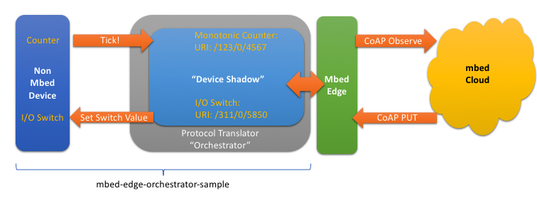

# Mbed Edge Orchestrator Sample

Simplified PT Client for mbed-edge

This PT sample creates the following simulated non-mbed device and "shadows" the device within mbed Cloud via mbed-edge:

This sample serves as a basic template for integrating more sophisticated non-mbed devices into mbed Cloud via mbed-edge.

## Details

The non-mbed device is "shadowed" in mbed Cloud through mbed-edge's Protocol Translator (PT): 

- View "main.cpp" and see how everything gets constructed and tied together...

- Carefully review the "Orchestrator" class as well as the "DeviceShadow" class and their respective roles and functions. 

- The non-mbed device simply "ticks" an updated counter value once every 25 seconds and also has a basic I/O switch state. 

- The "tick" behavior of the device is modelled as an observable "counter" resource (URI: /123/0/4567) in mbed Cloud via the "DeviceShadow" through PT

- The I/O switch behavior of the device is modelled as a simple get/put switch resource (URI: /311/0/5850) in mbed Cloud via the "DeviceShadow" through PT

For more information on mbed-edge, please see: https://github.com/ARMmbed/mbed-edge.

## To build/compile (linux supported only):

	- Clone and compile https://github.com/ARMmbed/mbed-edge 
		- for simplicity, use developer-flow enrollment
	- Clone this repo
	- Edit "build.sh" and adjust the EDGE_REPO variable to point to your compiled instance of "mbed-edge"
	- Execute "./build.sh"
	- In a separate window, launch the edge-core runtime
	- Execute "./run.sh"

